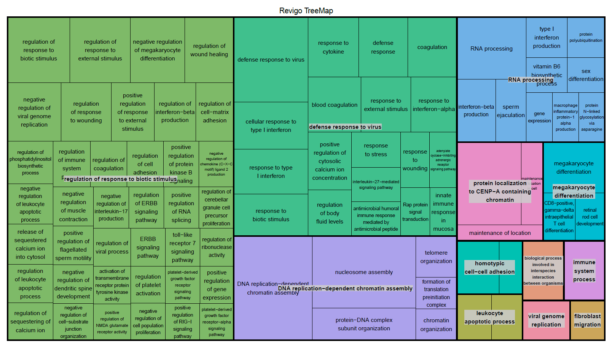

```{r setup, include=FALSE}
knitr::opts_chunk$set(echo = TRUE)
```

### Load read counts

```{r environment_setup,warning=F,message=F}
library(dplyr)
library(tidyverse)
library(ggplot2)
library(DESeq2)
library(magrittr)
library(pheatmap)
library(gtable)
library(EnhancedVolcano)
library(goseq)
library(apeglm)
wd <- "C:/Yuchen/WCM/Courses/2023Spring/CMPB5004/project/angsd_project/fc_result/"
```

#### Load read count table

```{r load_read_count_table}
# load read counts and format the data table
readcounts <- read.table(paste0(wd,"feature_counts.txt"),header=T)
orig_names <- names(readcounts)
# preserve the SRR ID only
names(readcounts) <- gsub(".*(symptomatic|uninfected).(SRR)([0-9]{8}).*","\\2\\3",orig_names)
str(readcounts)
```

#### Make and filter DESeq2 dataset

```{r make_deseq2_count_col_data}
# generate the countData and colData for DESeq2 from the formatted read count
row.names(readcounts) <- make.names(readcounts$Geneid)
readcounts <- readcounts[,-c(1:6)]
head(readcounts)
sample_info <- data.frame(condition=gsub(".*(symptomatic|uninfected).*","\\1",orig_names)[-c(1:6)],
                          row.names=names(readcounts))
sample_info
```

```{r make_and_filter_deseq_dataset, warning=F}
# make the DESeq dataset from formatted countData and colData
DESeq.ds <- DESeqDataSetFromMatrix(countData=as.matrix(readcounts),colData=sample_info,design=~condition)
DESeq.ds

# remove poor reads
keep_samples <- !(colnames(DESeq.ds)=="SRR15058644")
DESeq.ds <- DESeq.ds[,keep_samples]
# remove genes with 0 reads
keep_genes <- rowSums(counts(DESeq.ds))>0
DESeq.ds <- DESeq.ds[keep_genes,]
nonmt_genes <- !(grepl('^MT',rownames(DESeq.ds)))
DESeq.ds <- DESeq.ds[nonmt_genes]
dim(DESeq.ds)
```

#### Process DESeq2 dataset with log normalization and PCA

```{r calculate_apply_size_factor}
DESeq.ds <- estimateSizeFactors(DESeq.ds)
plot(sizeFactors(DESeq.ds),colSums(counts(DESeq.ds)),
     ylab="library sizes",xlab="size factors")

par(mfrow=c(1,2))
boxplot(log2(counts(DESeq.ds)+1),notch=T,
        main="Non-normalized",
        ylab="log2(read counts)",cex=0.6)
boxplot(log2(counts(DESeq.ds,normalized=T)+1),notch=T,
        main="Size-factor-normalized",
        ylab="log2(read counts)",cex=0.6)
```

```{r record_log_norm_counts}
assay(DESeq.ds,"log.counts") <- log2(counts(DESeq.ds,normalized=F)+1)
assay(DESeq.ds,"log.norm.counts") <- log2(counts(DESeq.ds,normalized=T)+1)

par(mfrow=c(1,2))
DESeq.ds[,c("SRR15058638","SRR15058641")] %>%
  assay(.,"log.norm.counts") %>%
  plot(.,cex=0.1,main="Symptomatic *38 vs *41")
DESeq.ds[,c("SRR15058625","SRR15058626")] %>%
  assay(.,"log.norm.counts") %>%
  plot(.,cex=0.1,main="Uninfected *25 vs *26")
```

```{r create_rlog_read_count_dataset}
DESeq.rlog <- rlog(DESeq.ds,blind=T)

par(mfrow=c(1,2))
plot(assay(DESeq.ds,"log.norm.counts")[,1:2],cex=0.1,
     main="size factor and log2-transformed")
plot(assay(DESeq.rlog)[,1:2],cex=0.1,
     main="rlog transformed")

rlog.norm.counts <- assay(DESeq.rlog)
```


```{r run_pca_on_log_norm_counts}

log.norm.counts = assay(DESeq.ds,"log.norm.counts")
pca <- prcomp(log.norm.counts,scale=T)
head(pca$rotation[,1:5])
qplot(c(1:length(pca$sdev)),pca$sdev^2/sum(pca$sdev^2)*100) + geom_line() +
  labs(x="PC",y="Variance Explained",main="Scree Plot") + ylim(0,100)
```


#### Run differential expression analysis

```{r prepare_run_DE_analysis, message=F, warning=F}
DESeq.ds$condition %<>% relevel(ref="uninfected")
DESeq.ds %<>% DESeq()
rowData(DESeq.ds) %>% colnames
rowData(DESeq.ds)$WaldPvalue_condition_symptomatic_vs_uninfected %>%
  hist(breaks=20,main="Raw p-values for symptomatic vs uninfected")
```

```{r adjust_for_multiple_testing}
DGE.results <- na.omit(results(DESeq.ds,independentFiltering=T,alpha=0.05))
head(DGE.results)
summary(DGE.results)
table(DGE.results$padj<0.05)
```

```{r sort_padj_and_plot}
DGE.results$padj %>% 
  hist(breaks=20,main="Adjusted p-value for symptomatic vs uninfected")
DGE.results.sorted <- DGE.results %>% `[`(order(.$padj),)
head(DGE.results.sorted)
```

```{r plot_counts}
par(mfrow=c(1,2))
plotCounts(DESeq.ds,gene="IL2",normalized=T,xlab="")
plotCounts(DESeq.ds,gene=which.max(DGE.results$padj),xlab="",
           main="Gene with max p.adj")
```

```{r plot_heatmaps, fig.width=8, fig.height=6}
DGEgenes <- rownames(subset(DGE.results.sorted,padj<0.05))
rlog.dge <- DESeq.rlog[DGEgenes,] %>% assay
pheatmap(rlog.dge,scale="none",show_rownames=F,main="DGE (no scaling)",
         color=colorRampPalette(RColorBrewer::brewer.pal(n=7,name="Reds"))(100))
pheatmap(rlog.dge,scale="row",show_rownames=F,main="DGE (row-based z-score)")
```

```{r volcano_plots, fig.width=8, fig.height=10}
EnhancedVolcano(DGE.results,lab=rownames(DGE.results),
                x='log2FoldChange',y='padj',pCutoff=0.05,
                title="Symptomatic vs. Uninfected",
                pointSize=2.5,labSize=5.0)
```

```{r perform_logfc_shrinkage, message=F, warning=F}
DGE.results.shrnk <- lfcShrink(DESeq.ds,coef=2,type="apeglm")
par(mfrow=c(1,2))
plotMA(DGE.results,alpha=0.05,main="no shrinkage",ylim=c(-6,8))
plotMA(DGE.results.shrnk,alpha=0.05,main="with logFC shrinkage",ylim=c(-6,8))
```


```{r volcano_plot_with_logfc_shrinkage, fig.width=8, fig.height=10}
EnhancedVolcano(DGE.results.shrnk,lab=rownames(DGE.results.shrnk),
                x='log2FoldChange',y='padj',pCutoff=0.05,
                title="Symptomatic vs. Uninfected with logFC shrinkage")
```


```{r volcano_plot_remove_rna, fig.width=8, fig.height=10}
clean_gene <- !(grepl('(RNA|LOC|SNOR)',rownames(DGE.results.shrnk)))
DGE.results.clean <- na.omit(DGE.results.shrnk[clean_gene,])
EnhancedVolcano(DGE.results.clean,lab=rownames(DGE.results.clean),
                x='log2FoldChange',y='padj',pCutoff=0.05,
                title="Symptomatic vs. Uninfected cleaned")
```


```{r go_term_analysis}
DGE.genes <- rownames(subset(DGE.results,padj<0.05))
head(DGE.genes)
gene.vector <- row.names(DGE.results) %in% DGE.genes %>% as.integer
names(gene.vector) <- row.names(DGE.results)
pwf <- nullp(gene.vector, 'hg19', 'geneSymbol')
```

```{r continue_go_analysis}
GO.wall <- goseq(pwf,"hg19","geneSymbol")
dim(GO.wall)
head(GO.wall)
go_genes <- getgo(rownames(DGE.results),"hg19","geneSymbol") %>% stack
head(go_genes)
sig_GOs <- subset(GO.wall, over_represented_pvalue < 0.01)
dim(sig_GOs)
head(sig_GOs$term, n = 20)
```

```{r revigo, warning=F}
write.table(sig_GOs[, c("category","over_represented_pvalue")],
    file = "Enriched_GOterms_goseq.txt",
    quote = FALSE, row.names = FALSE, col.names = FALSE)
source("final_revigo_treemap.R")
```




