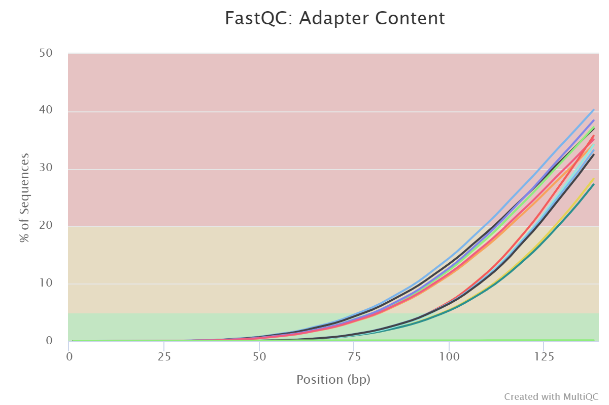
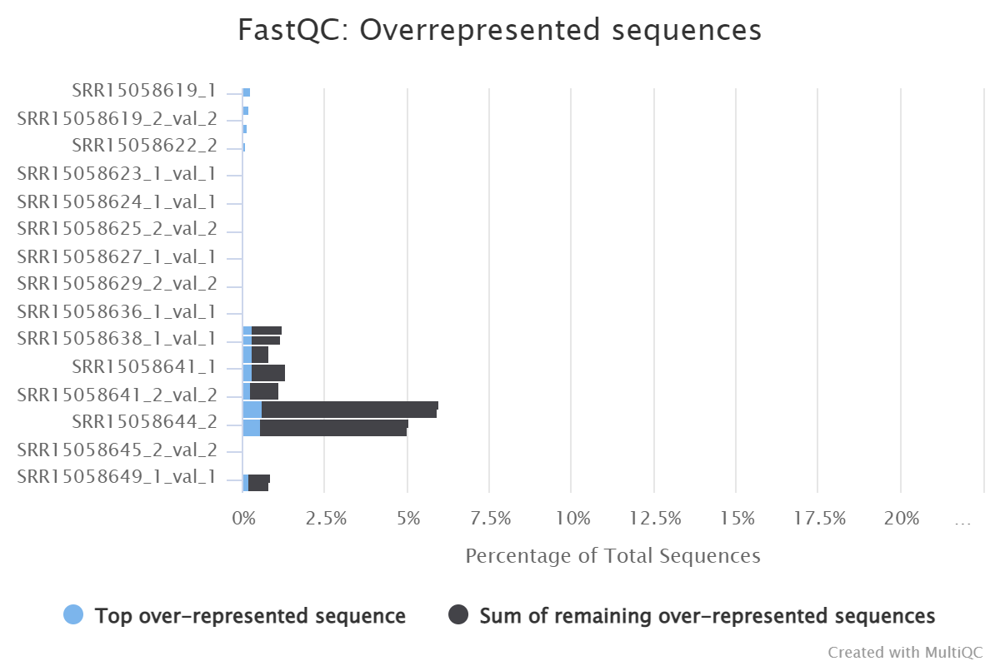
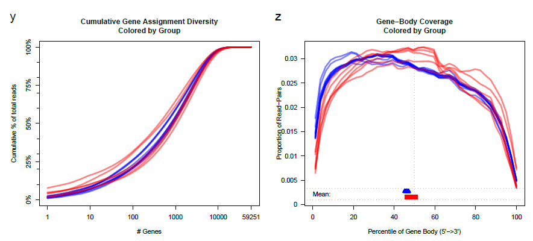
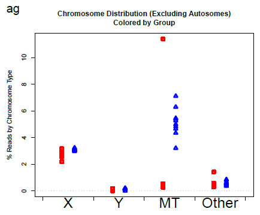
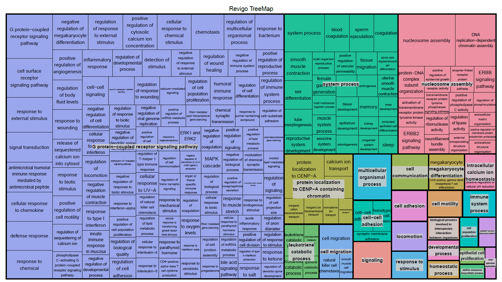

```{r setup, include=FALSE}
knitr::opts_chunk$set(echo=T,tidy.opts=list(width.cutoff=60),tidy=T,warning=F,message=F,fig.align='center')
```

```{r setup_environment, message=F, warning=F, include=F}
library(knitr)
library(dplyr)
library(tidyverse)
library(ggplot2)
library(DESeq2)
library(magrittr)
library(pheatmap)
library(gtable)
library(EnhancedVolcano)
library(goseq)
library(apeglm)
fcwd <- "C:/Yuchen/WCM/Courses/2023Spring/CMPB5004/project/angsd_project/fc_result/"
rswd <- "C:/Yuchen/WCM/Courses/2023Spring/CMPB5004/project/angsd_project/record/"
```

\newpage

## Introduction

The coronavirus disease-2019 (COVID-19), caused by the severe acute respiratory syndrome coronavirus (SARS-CoV-2), was first detected in Wuhan, China, back in December 2019, and developed to a critical global pandemic over the past three years. There has been many studies towards the nature of SRAS-CoV-2 as well as the mechanism of viral invasion, so that more effective treatments can be developed. It is faily understood that the virus invades human cells by attaching the Spike structure to the ACE2 receptor on human cells and further hijacking the host cells' ability of replication and transcription^1^. However, the more complicated situation which is not fully studied at this point is the gene regulation behind the viral invasion, and there is not yet a comprehensive answer to the question regarding the difference of gene expression in the healthy people versus that in a COVID-19 patient.

Given that human peripheral blood mononuclear cells (PBMC) has crucial function in human immune system, it is very valuable to study the PMBC transcriptomic difference in healthy versus infected people and to extract potentially differentially expressed genes, as these genes might provide more insight into the underlying pathway of COVID-19 associated severe symptoms as well as shedding light on better potential targets for pharmaceutical treatments against COVID-19. Hence, this project collects human PBMC transcriptome dataset and conducted differential gene analysis, focusing on significant differential expression of genes related to crucial cytokine storm pathways such as NF-$\kappa$B pathway.


## Methods

### Data download

The data used in this project is linked to this paper^2^. The data description metadata is retrieved from the [SRA Run Selector](https://www.ncbi.nlm.nih.gov/Traces/study/?acc=SRP327322&f=immune_response_sam_s%3An%3Asymptomatic%2Cuninfected%3Ac&o=acc_s%3Aa), whereas the actual sequencing data with `.fastq.gz` format is retrieved from the [ENA](https://www.ebi.ac.uk/ena/browser/view/PRJNA744408). The original data contains five groups: uninfected (22), recovering (15), symptomatic (13), re-detectable positive (RP) (12), and asymptomatic (8). However, in this project, only data from uninfected and symptomatic patients is used. A bash script is used to download data by first retrieving the the corresponding sample SRR ID, which is then used to create an `ftp` connection with the specific ENA web address hosting the paired-end read files of that sample, and using `wget` to download the files. Each read file is automatically put into the corresponding directory (uninfected or symptomatic) after the download is complete.

### Read preprocessing

After downloading all read files, a FastQC run is used to determine the quality of the raw reads. It was discovered that most of the paired-end reads has high adapter content that failed the quality check. Hence, Trim-Galore was used to trim the raw reads by the command

```{trim_galore_key_command, warning=F}
trim_galore --illumina --paired \
            --output_dir $trim_out_dir \
            --stringency 13 $file $file2
```

Notice that the parameter `--illumina` and `--paired` was added to the command given that the original raw reads are produced by illumina paired-end sequencing, and that the parameter `--stringency 13` is set as it is a length threshold more likely to prevent potentially wrong adaptor trimming due to small overlaps (this threshold was chosen according to previous runs of Trim-Galore on the same data). `$trim_out_dir` represents the directory that holds the trimmed reads output of Trim-Galore, whereas `$file` and `file2` represents the two paired-end reads. After running Trim-Galore, another FastQC run is used to determine the quality of the trimmed reads, which are all proven to have low adatper content and are available for further processing. All scripts for this part of the preprocessing is put into a bash script to enable automatic FastQC run before and after Trim-Galore trimming.

### Sequence alignment

In this project, STAR alignment tool is used to align the trimmed reads to the genome. Before running actual alignments, an index for STAR alignment is created by the command

```{STAR_index_creation_key_command, warning=F}
STAR --runMode genomeGenerate \
     --runThreadN 1 \
     --genomeDir $ref_dir \
     --genomeFastaFiles $genome_seq \
     --sjdbGTFfile $genome_annot \
     --sjdbOverhang 149
```

Notice that the parameter `--sjdbOverhang 149` was added to the command instead of the default value (99) in order to reflect the fact that the original raw reads are produced by 2 $\times$ 150bp paired-end sequencing protocal, given that the best value for this parameter is usually the sequence length - 1. `--genomeDir $ref_dir` represents the directory that holds the STAR index output, where as `--genomeFastaFiles $genome_seq` and `--sjdbGTFfile $genome_annot` represents the actual genome sequence file (in `FASTA` format) and the genome annotation file (in `GTF` format), respectively. Human genome `hg38` is used in this project, and a bash script is used to download both genome files (`hg38.fa.gz` and `hg38.ncbiRefSeq.gtf.gz`) from the [UCSC Genome Data website](https://hgdownload.soe.ucsc.edu/goldenPath/hg38/bigZips/) using `wget`. The script also contains the commands to execute the STAR index creation after verifying that the required genome files are downloaded and gzipped in the correct directory.

After creating the index, the STAR alignment is performed by the command

```{STAR_alignment_key_command, warning=F}
STAR --runMode alignReads \
     --runThreadN 1 \
     --genomeDir $ref_dir \
     --readFilesIn $file $file2 \
     --readFilesCommand zcat \
     --outFileNamePrefix $out_dir \
     --outSAMtype BAM SortedByCoordinate
```

Notice that parameter for file input `--readFilesIn` is provided with two files (`$file` and `$file2`) in order to simultaneously align the two paired-end reads from each sample. `--genomeDir $ref_dir` represents the directory that holds the STAR index just created, whereas `--outFileNamePrefix $out_dir` represents the directory that holds the STAR alignment output files. `--readFilesCommand zcat` was also added in order to directly access read files in a gzipped format. Finally, `--outSAMtype BAM` is used to change the alignment output file to `BAM` format in order to save memory usage, and `SortedByCoordinate` parameter was added to force the alignment results to be sorted by their coordinate in the reference genome.

After performing STAR alignment, `samtools` was also used to index the alignment output (in `BAM` format) by the command

```{samtools_index_key_command, warning=F}
samtools index $out_file
```

A separate bash script containing the STAR alignment commands and the samtools commands is used to allow automatic alignment, sorting, and indexing procedure for each sample used in this project.

With these steps, the sequence alignment in this project would produce an indexed and sorted by coordinate `BAM` file for each sample as the alignemnt output.

### Quality control

This project conducts FastQC run as one method of quality control, as introduced in the previous section (see Read preprocessing), in order to monitor the quality of the raw reads and the trimmed reads after performing Trim-Galore. FastQC is performed by the command

```{FastQC_key_command, warning=F}
fastqc $file --noextract --outdir $fastqc_out_dir
```



[*Figure 1. Adaptor content plot generated by FastQC, retrieved from MultiQC. 12 samples of untrimmed reads failed the adaptor contents check, while the rest 32 trimmed samples (16 samples with trimmed paired-end reads) satisfy the adaptor content check.*]()




[*Figure 2. Over-represented sequences plot generated by FastQC, retrieved from MultiQC. All samples satisfy the over-represented sequences check, but SRR15058644 clearly has higher over-represented sequences content and is given a warning.*]()


On the test run of the read files from 12 samples, the raw reads of these samples all fails the adapter content check by FastQC. However, after performing Trim-Galore, all 12 trimmed reads has low adapter content that passes the adapter content test. This continues to be true for all trimmed reads from other samples after performing Trim-Galore. However, it is worth noticing from the FastQC result that both of the paired-end reads of sample SRR15058644 contains higher over-represented sequences level, causing a warning to be raised.

This project also conducts QoRTs run as another qualtity control in order to monitor the quality of the alignment results. QoRTs is performed by the command

```{QoRTs_key_command, warning=F}
qorts -Xmx16G QC --generatePlots \
      --maxPhredScore 45 --maxReadLength 150 \
      $file $gtffile $outdir
```



[*Figure 3. Gene-body coverage plot generated by QoRTs, retrieved from QoRTs report. Gene-body coverage is mostly uniform for all samples.*]()


```{r center_figure_4, echo=F, message=F, warning=F, fig.width=5, fig.height=5, fig.align='center'}
    
```

[*Figure 4. Chromosome distribution plot generated by QoRTs, retrieved from QoRTs report. One sample from symptomatic group contains higher percentage of reads from MT.*]()


The plots for QoRTs are generated by running first a bash script that creates the decoder for plotting, then a bash script with the command above to perform QoRTs, and finally an R code that reads in the decoder as well as the QoRTs result, returning the plots in a PDF format. It was discovered that the cumulative gene assignment diversity appears to be of the correct trend, and that the gene-body coverage is roughly uniform across the gene body for all samples. Some concerns are raised from examing the QoRTs result: one sample from the symptomatic group contains high percentage of reads from MT chromosome, and all samples from symptomatic group seems to have higher percentage of intron coverage. The extra gene content from the MT origin can be processed in loading the preprocessing the feature counts (which can remove gene counts from mitochondrial genes), but it is admittedly unclear whether the higher intron coverage of the symptomatic group is due to genetic reasons specific to the group or some type of contamination.

This project uses MultiQC to summarize all quality control outputs, including FastQC, QoRTs, and the alignment results. MultiQC is performed by the command

```{MultiQC_key_command, warning=F}
multiqc $alndir $fcdir $qcdir -o $resdir
```

### Feature counts

The feature counts for this project is created by the `featureCounts` with the command

```{feature_counts_key_command, warning=F}
featureCounts -p --countReadPairs -a $gtf -t exon -g gene_id -o $fc_dir $bam_dir*/*.bam
```

Notice that the parameter `--countReadPairs` was added in order to specify the paired-end nature of the reads. A bash script containing the command above is used to automatically run feature counts for all alignment results (in `BAM` format) and store the output feature counts information in the corresponding directory. The feature counts is then read into `R` with the DESeq2 object to perform preprocessing and quality control steps.

```{r load_feature_counts_table_to_DESeq, message=F, warning=F}
# load read counts and format the data table
readcounts <- read.table(paste0(fcwd,"feature_counts.txt"),header=T)
orig_names <- names(readcounts)
# preserve the SRR ID only
names(readcounts) <- gsub(".*(symptomatic|uninfected).(SRR)([0-9]{8}).*","\\2\\3",orig_names)
# generate the countData and colData for DESeq2 from the formatted read count
row.names(readcounts) <- make.names(readcounts$Geneid)
readcounts <- readcounts[,-c(1:6)]
sample_info <- data.frame(condition=gsub(".*(symptomatic|uninfected).*","\\1",orig_names)[-c(1:6)],
                          row.names=names(readcounts))

# make the DESeq dataset from formatted countData and colData
DESeq.ds <- DESeqDataSetFromMatrix(countData=as.matrix(readcounts),colData=sample_info,design=~condition)
# remove samples with poor reads
keep_samples <- !(colnames(DESeq.ds)=="SRR15058644")
DESeq.ds <- DESeq.ds[,keep_samples]
# remove genes with 0 reads
keep_genes <- rowSums(counts(DESeq.ds))>0
DESeq.ds <- DESeq.ds[keep_genes,]
# remove mitochondrial genes
nonmt_genes <- !(grepl('^MT',rownames(DESeq.ds)))
DESeq.ds <- DESeq.ds[nonmt_genes]
# remove pseudo/RNA genes
nonpseudo_genes <- !(grepl('(RNA|LOC|SNOR)',rownames(DESeq.ds)))
DESeq.ds <- DESeq.ds[nonpseudo_genes]

DESeq.ds
```

In preprocessing and quality control steps, after the feature counts table is read into R, only the SRR ID is kept as the name for each sample. However, a table containing the information of each sample and its corresponding group (either uninfected or symptomatic) is kept. The genes are also renamed by the gene ID. After the read counts table is added to a DESeq2 dataset object, samples with poor reads (SRR15058644 due to higher overrepresented sequence level), mitochondrial genes, pseudogenes, RNA component genes, and genes with 0 reads are removed from the dataset.

```{r log_normalize_dataset, message=F, warning=F}
# estimate size factors
DESeq.ds <- estimateSizeFactors(DESeq.ds)
# log normalize the dataset
assay(DESeq.ds,"log.norm.counts") <- log2(counts(DESeq.ds,normalized=T)+1)

# perform r log on the dataset
DESeq.rlog <- rlog(DESeq.ds,blind=T)
```

The dataset is then normalized to eliminate the non-biological difference on the dataset, adding the log normalized counts to the dataset as a separate assay. In order to reduce the dependence of the variance on the mean, an `rlog` is also performed on the dataset, which then generates a new object for the dataset.

### Differential gene analysis

In this project, the differential gene analysis is performed by using DESeq2 function `DESeq()` on the preprocessed and log normalized dataset. The results of differential gene analysis is then adjusted for multiple hypothesis testing correction and cleaned by removing genes with an `NA` in either p-value or adjusted p-value. The alpha for significance is chosen to be 0.05, so that a gene is deemed as differentially expressed only when it has an adjusted p-value of less than 0.05. In order to cope with the unreliable fold change results for genes with noisy expression values, and to better integrate the solution for plotting, the log FC shrink is also performed on the dataset to generate a more valid result.

```{r DGE_analysis_process, message=F, warning=F}
# perform differential expression analysis
DESeq.ds$condition %<>% relevel(ref="uninfected")
DESeq.ds %<>% DESeq()
# retrieve raw and sorted DGE results
DGE.results.raw <- na.omit(results(DESeq.ds,independentFiltering=T,alpha=0.05))
DGE.results.raw.sorted <- DGE.results.raw %>% `[`(order(.$padj),)

# retrieve lfcShrink-ed and sorted DGE results
DGE.results.shrnk <- lfcShrink(DESeq.ds,coef=2,type="apeglm")
# retrieve cleaned results
DGE.results.clean <- na.omit(DGE.results.shrnk)
DGE.results.clean.sorted <- DGE.results.clean %>% `[`(order(.$padj),)

# subset significant genes
DGE.genes <- subset(DGE.results.clean.sorted,padj<0.05)
DGE.genes <- subset(DGE.genes,abs(log2FoldChange)>1)
DGE.genes.names <- rownames(DGE.genes)
```


## Results

### Significant differentially expressed genes

Using the `rlog` dataset, a heatmap of the significantly differentially expressed genes is created along with the hierarchical clustering of the genes as well as the samples. It is observed that the hierarchical clustering is almost 100% successful in distinguishing the symptomatic samples from the uninfected samples with one execption (SRR15058645, a symptomatic sample mistakenly clustered with uninfected sample). According to the heatmap, there is a observable difference in the pattern of gene expression in the symptomatic samples versus the uninfected samples: genes that are expressed at a significantly higher level in one group tends to be expressed at a lower lever in the other group. The exception of SRR15058645 is probably misclassified by a different pattern it demonstrates: for the genes that are highly expressed in the uninfected samples, SRR15058645 does show lower expression, but on the other hand, it doesn't show high enough expression for the genes that are observed to be highly expressed in the symptomatic samples.

```{r heatmap_significant_DGE, message=F, warning=F, fig.width=6, fig.height=6, fig.align='center'}
# generate heat maps of differentially expressed genes
rlog.dge <- DESeq.rlog[DGE.genes.names,] %>% assay
pheatmap(rlog.dge,scale='row',show_rownames=F,main="DGE (row-based z-score)")
```

[*Figure 5. The heatmap showing the overal expression of genes in the symptomatic versus the uninfected samples, together with the hierarchical clustering of the genes and samples. The heatmap is produced by `pheatmap` package in R with the previous `rlog` dataset, standardized with row-based z-score. SRR15058619, SRR15058622, SRR15058623, SRR15058624, SRR15058625, SRR15058626, SRR15058627, SRR15058629, SRR15058634, SRR15058636 are uninfected samples, and SRR15058638, SRR15058641, SRR15058645, SRR15058646, SRR15058649 are symptomatic samples.*]()


This project focused on key genes that are related to certain cytokine and chemokine storm pathways^3^. Using the previously retrieved DGE result containing the log2 fold change and the adjusted P-value, a volcano plot is generated, and the key genes selected are marked with label and arrows pointing to their location in the plot. It is identified that some signature genes related to cytokines, including CXCL-10, IL-2, IL-6, TNF-$\alpha$, IFN-$\gamma$, etc., and cellular defense pathways genes, such as TP53 pathway genes, are either upregulated or downregulated with high significance. It is worth noticing that while some genes directly related to these cytokines and pathways can be directly monitored (e.g., CXCL-10, IFN-$\gamma$), others are shown in the dataset as either cytokine receptors subunits (e.g., IL-2 and IL-6) or induced proteins (e.g, TNF-$\alpha$IP and TP53INP).

```{r volcano_plot_significant_DGE, message=F, warning=F, fig.width=8, fig.height=9, fig.align='center'}
# select key genes
key_genes <- "^(IL2R|IL6R|TNFAIP|CCL2&|CXCL10|TNFSF10|TP53INP|TAB2|IFNG)"
DGE.gene.key <- DGE.genes[grepl(key_genes,DGE.genes.names),]
DGE.genes.names.key <- DGE.genes.names[grepl(key_genes,DGE.genes.names)]
# generate volcano plot of differentially expressed genes
EnhancedVolcano(DGE.results.clean,lab=rownames(DGE.results.clean),
                selectLab=DGE.genes.names.key,
                boxedLabels=T,labCol='black',
                labFace='bold',drawConnectors=T,
                widthConnectors=1.0,colConnectors='black',
                pointSize=3.0,labSize=4.0,colAlpha=0.75,
                x='log2FoldChange',y='padj',
                pCutoff=0.05,FCcutoff=2.0,
                title='Symptomatic vs. Uninfected')
```

[*Figure 6. The volcano plot showing the differential expression of genes in the symptomatic versus the uninfected samples with the log2 fold change and the adjusted P-value. The volcano plot is generated by `EnhancedVolcano` package in R with the previous DGE result dataset. Key genes related to cytokine storm pathways and cellular defense pathways are marked in the plot. Adjusted P-value cutoff is set at 0.05 and log2 fold change cutoff is set at 2.0.*]()


In order to investigate the functional pathways and the biological processes associated with the differentially expressed genes, a GO-term analysis was conducted with the `goseq` package. The result shows the over-representation of multiple pathways associated with immune responses, including defense response against bacteria, innate immune response in mucosa, regulation of T-helper 1 type immune response, etc. The result also demonstrates over-representation of multiple chemokine or cytokine-mediated signaling pathways, as well as some signature cascade pathways such as IL-8 cellular response, IL-27-mediated signaling pathway, type-I interferon response, chemokine (C-X-C motif) ligand 2 production, etc. However, no significant differentially expressed genes or over-represented functional pathways are found to be directly associated with the NF-$\kappa$B pathway.

### GO term analysis

```{r go_term_analysis, message=F, warning=F}
# construct named vector of 0 and 1 for DEG
gene.vector <- row.names(DGE.results.clean) %in% DGE.genes.names %>% as.integer
names(gene.vector) <- row.names(DGE.results.clean)
# quantify length bias
pwf <- nullp(gene.vector,'hg19',"geneSymbol",plot.fit=F)
# test for enrichment of GO terms
GO.wall <- goseq(pwf,"hg19","geneSymbol")
# retrieve GO categories of each gene
go_genes <- getgo(rownames(DGE.results.clean),"hg19","geneSymbol") %>% stack
sig_GOs <- subset(GO.wall,over_represented_pvalue<0.01)
# export file for REVIGO plotting
write.table(sig_GOs[,c("category","over_represented_pvalue")],
            file="final_GOterms_goseq.txt",
            quote=F,row.names=F,col.names=F)
# include Revigo treeplot R script
source("final_REVIGO_treeplot.R")
```



[*Figure 7. The GO-term analysis and the tree map showing the underlying biological processes and functional pathways of the differentially expressed genes. The GO-term analysis is completed by `goseq` package in R with the previous DGE result dataset. Reference genome used is hg19 with annotations as geneSymbol. The tree map is generated by REVIGO after providing the results for GO-term analysis. The size of the rectangles in the tree map corresponds to the negative inverse of log P-value of the enrichment. The colors correspond to similar functional terms.*]()


## Discussion

This project discovered multiple significant differentially expressed genes upregulated or downregulated in the symptomatic samples compared with that in the uninfected samples. Among these include CXCL-10, which has about +4 log2 fold change with -log10 P-value of around 10. CXCL-10 has been demonstrated as a crucial player in inducing the cytokine storm reaction upon COVID-19 infection^4^. It is also mentioned that certain component of the SARS-CoV-2 virus protein structure may interfere with the production of interferon type I and II, which may provide an explanation to the significant downregulation of IFN-$\gamma$ (with about -4 log2 fold change with -log10 P-value of around 7), a type II interferon, discovered in this project. Unfortunately, no direct NF-$\kappa$B pathway related genes are found in the significant differentially expressed genes, so that there might not be a powerful argument suggesting that the initial hypothesis is true. However, it is not to say that the project result does not imply the possibility that the NF-$\kappa$B pathway is a crucial component of the immune response upon COVID-19 infection. It is observed that the IL-6 component, such as the receptor subunit IL-6R.AS1, and some TNF-$\alpha$ induced proteins, such as TNF-$\alpha$IP8L2, are upregulated in the symptomatic samples, and it might serve as an indicator of the activation of NF-$\kappa$B-driven inflammatory response^5^.

The limitation of this project is the small dataset size. This project only included 15 individuals in the final analysis due to the strict selection of responses, ages, and read alignment quality controls. Among these 15 individuals, only 5 belongs to the symptomatic group. Although steps are taken to normalize the read counts during the analysis, there is still an obvious bias towards the uninfected group that can affect the results of the analysis. Another problem of this project is encounted during the GO-term analysis, as there is no available version of the genome annotation for hg38 genome to be used in R packages. This project used hg19 instead, believing that most of the genome annotations should be similar. However, it could be possible that the difference in annotations (mismatched genes or unmatched genes) caused difference in the final GO-term analysis results. In order to have a more precise and robust result, a larger sample size and the updated genome annotation package is necessary in future studies.


## Code Availability

```{r save_generated_datasets, message=F, warning=F}
# export file for processed read counts dataset
write.table(readcounts,file=paste0(rswd,"readcounts.txt"),
            quote=F,row.names=T,col.names=T)
# export file for DGE results cleaned dataset
write.table(DGE.results.clean,file=paste0(rswd,"DGEclean_results.txt"),
            quote=F,row.names=T,col.names=T)
# export GO-term analysis results
write.table(sig_GOs,file=paste0(rswd,"GOterm_results.txt"),
            quote=F,row.names=F,col.names=F)
# save RData for important objects
save(readcounts,DESeq.ds,DESeq.rlog,
     DGE.genes,DGE.results.raw,DGE.results.clean,
     rlog.dge,pwf,sig_GOs,
     file=paste0(rswd,"finalproject.RData"))
```

All scripts related to this project, including bash scripts, R scripts, R Markdown scripts, etc., together with some intermediate checkpoints results, important dataset files, and RData, can all be found in the public GitHub repository [kevinsunofficial/angsd_project](https://github.com/kevinsunofficial/angsd_project). The contents are also available on the Weill Cornell Aphrodite server following directory `/home/yus4008/cmpb5004/project/angsd_project/`. The raw data availablity is explained in the Methods section of this report (see Data downloading). The key datasets are saved as table format using txt files, with all other important datasets saved as RData that can be loaded directly into the environment. The following table summarizes all output files for this project.

```{r table_of_output_files, echo=F, results='asis'}
files <- data.frame(filename=c("readcounts.txt",
                               "DGEclean_results.txt",
                               "GOterm_results.txt",
                               "finalproject.RData"),
                    contents=c("read counts dataset",
                               "DGE results cleaned dataset",
                               "GO-term analysis results",
                               "RData for important objects"),
                    availability=c("GitHub, Aphrodite",
                                   "GitHub, Aphrodite",
                                   "GitHub, Aphrodite",
                                   "GitHub, Aphrodite"))
kable(files)
```

[*Table 1. The names, content descriptions, and availability of all output files generated from this project.*]()


## Reference

1. Amirfakhryan, H., & Safari, F. (2021). Outbreak of SARS-CoV2: Pathogenesis of infection and cardiovascular involvement. *Hellenic journal of cardiology : HJC = Hellenike kardiologike epitheorese, 62*(1), 13-23. https://doi.org/10.1016/j.hjc.2020.05.007

2. Zhang, J., Lin, D., Li, K., Ding, X., Li, L., Liu, Y., Liu, D., Lin, J., Teng, X., Li, Y., Liu, M., Shen, J., Wang, X., He, D., Shi, Y., Wang, D., & Xu, J. (2021). Transcriptome analysis of peripheral blood mononuclear cells reveals distinct immune response in asymptomatic and re-detectable positive COVID-19 patients. *Frontiers in Immunology, 12*. https://doi.org/10.3389/fimmu.2021.716075

3. Xiong, Y., Liu, Y., Cao, L., Wang, D., Guo, M., Jiang, A., Guo, D., Hu, W., Yang, J., Tang, Z., Wu, H., Lin, Y., Zhang, M., Zhang, Q., Shi, M., Liu, Y., Zhou, Y., Lan, K., & Chen, Y. (2020). Transcriptomic characteristics of bronchoalveolar lavage fluid and peripheral blood mononuclear cells in COVID-19 patients. *Emerging microbes & infections, 9*(1), 761-770. https://doi.org/10.1080/22221751.2020.1747363

4. Ramasamy, S., & Subbian, S. (2021). Critical Determinants of Cytokine Storm and Type I Interferon Response in COVID-19 Pathogenesis. *Clinical microbiology reviews, 34*(3), e00299-20. https://doi.org/10.1128/CMR.00299-20

5. Hadjadj, J., Yatim, N., Barnabei, L., Corneau, A., Boussier, J., Smith, N., Péré, H., Charbit, B., Bondet, V., Chenevier-Gobeaux, C., Breillat, P., Carlier, N., Gauzit, R., Morbieu, C., Pène, F., Marin, N., Roche, N., Szwebel, T. A., Merkling, S. H., Treluyer, J. M., … Terrier, B. (2020). Impaired type I interferon activity and inflammatory responses in severe COVID-19 patients. *Science (New York, N.Y.), 369*(6504), 718-724. https://doi.org/10.1126/science.abc6027
